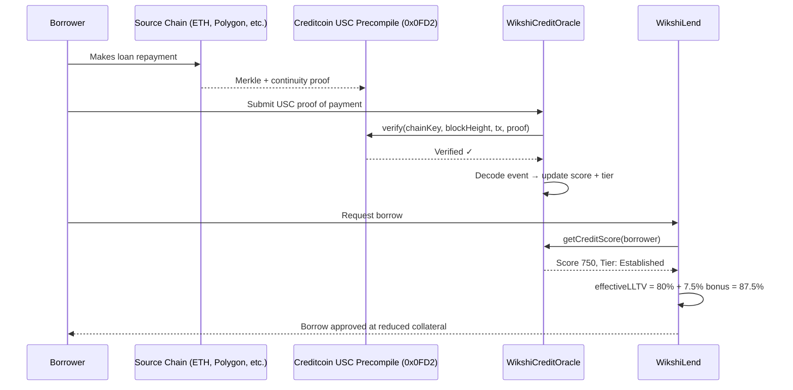
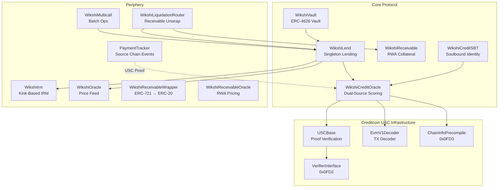
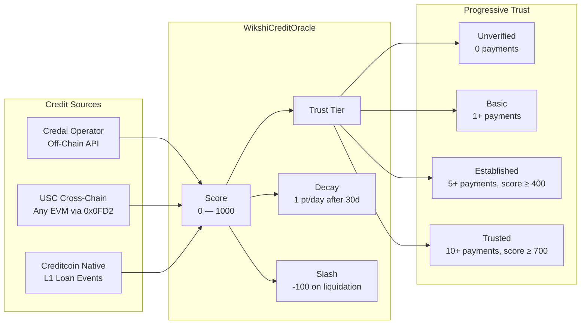
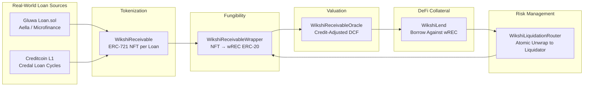

<p align="center">
  <h1 align="center">Wikshi Protocol</h1>
  <p align="center"><strong>Credit-native lending on Creditcoin — where your repayment history unlocks better terms.</strong></p>
</p>

<p align="center">
  
  
  
  
  
  
</p>

<p align="center">
  <a href="https://github.com/Miny-Labs/wikshi/raw/main/docs/wikshi-whitepaper.pdf"><strong>Read the Whitepaper</strong></a>
</p>

---

## Overview

Wikshi is the first lending protocol on Creditcoin that makes credit history matter. Creditcoin has recorded 5M+ real-world loan transactions and $80M+ in credit volume across emerging markets through its partnerships with Aella and microfinance institutions — but until now, none of that data has been usable inside DeFi. Wikshi changes that.

The protocol uses Creditcoin's [Universal Smart Contract (USC)](https://docs.creditcoin.org/) precompiles to verify cross-chain payment proofs from any EVM chain. These proofs feed an on-chain credit oracle that adjusts collateral requirements, interest rates, and liquidation thresholds per borrower. A borrower with verified repayment history across Ethereum, Polygon, or Creditcoin's native loan cycles gets better terms. Liquidation triggers credit slashing. Inactivity triggers decay. The system is self-correcting.

Wikshi also tokenizes real-world loan receivables — from Gluwa's Loan.sol, Aella microfinance portfolios, and Creditcoin's native Credal-powered loan cycles — into on-chain collateral. Receivables are minted as ERC-721 NFTs, wrapped into fungible ERC-20 tokens, priced using a credit-adjusted DCF model, and accepted as collateral in lending markets. This is the RWA-to-DeFi bridge that turns Creditcoin's existing real-world credit infrastructure into composable capital.

Architecture follows the Morpho Blue pattern — one contract, infinite isolated markets, permissionless composition.

---

## How It Works



---

## Architecture



---

## Features

| Feature | Description |
|---------|-------------|
| **Morpho Blue Architecture** | Singleton lending with isolated markets — one contract, infinite markets |
| **Credit-Adjusted LLTV** | Trust tier gates LLTV bonus (Unverified borrowers get no advantage) |
| **USC Cross-Chain Verification** | Read payment history from any EVM chain via Creditcoin's USC precompiles (`0x0FD2`, `0x0FD3`) |
| **Creditcoin Native Event Ingestion** | Directly processes Creditcoin L1 loan events (`LoanFundInitiated`, `LoanRepaid`, `LoanExpired`) |
| **Gluwa Loan.sol Integration** | Decodes and scores events from Gluwa's CCNext Loan.sol contract on any USC-supported chain |
| **Credal-Compatible Operator** | Pluggable off-chain scoring via operator role — compatible with Creditcoin's Credal API infrastructure |
| **Score Decay** | 1 point/day after 30-day grace period — VIEW-only computation, zero gas |
| **Credit Slashing** | Liquidation triggers -100 score penalty |
| **Progressive Trust Tiers** | Unverified → Basic → Established → Trusted |
| **ERC-4626 Vault** | Passive lending with 6-decimal offset for inflation attack protection |
| **Soulbound Credit Identity** | ERC-5192 non-transferable credit NFT — composable across the Creditcoin ecosystem |
| **RWA Receivables** | Tokenized real-world loan receivables as on-chain collateral with credit-adjusted DCF valuation |
| **EIP-712 Authorization** | Gasless operations, bundler-compatible signature authorization |
| **Supply/Borrow Caps** | Per-market risk limits, owner-configurable |
| **Pause Mechanism** | Emergency inflow stop — withdrawals, repayments, and liquidations always work |
| **Flash Loans** | Atomic borrow + repay for liquidation bots and arbitrageurs |
| **Credit-Aware IRM** | Kink-based interest rates with up to 20% discount for high-score borrowers |
| **Fee-on-Transfer Defense** | Balance-checked transfers protect against deflationary tokens |
| **Multicall** | Typed batch operations (supplyCollateral + borrow in 1 tx) |

---

## Credit System

The credit oracle ingests payment events from three sources that span the Creditcoin ecosystem:



| Parameter | Value |
|-----------|-------|
| Score Range | 0 — 1000 (initial: 300) |
| LLTV Bonus | Up to +10% (requires Established tier or above) |
| Decay | 1 point/day after 30-day grace period |
| Slash Penalty | -100 points per liquidation |
| Credit Rate Discount | Up to 20% off pool rate (score 1000) |

**Credit Event Sources**:
- **USC Cross-Chain**: `PaymentMade`, Gluwa `Loan.sol` events (`LoanRepaid`, `LoanExpired`, `LoanLateRepayment`) — verified via Creditcoin's USC precompile at `0x0FD2` with Merkle + continuity proofs
- **Creditcoin Native**: `LoanFundInitiated`, `LoanRepaid`, `LoanLateRepayment`, `LoanExpired` — from Creditcoin's 5M+ on-chain loan transaction history
- **Off-Chain**: Credal operator — pluggable scoring model compatible with Creditcoin's Credal API, which powers real-world lending for partners like Aella (2M+ borrowers)

---

## Real-World Assets (RWA) as Collateral

Creditcoin connects DeFi to traditional asset classes — bonds, receivables, microfinance portfolios — across emerging markets. Wikshi implements a full RWA receivables pipeline (~950 lines across 4 contracts) that takes this from vision to working infrastructure: real-world loans originated through Gluwa's Loan.sol and Creditcoin's native Credal-powered loan cycles become usable DeFi collateral.



### How It Works

1. **Loan Origination** — A real-world loan is funded through Gluwa's Loan.sol (Aella microfinance, emerging market lenders) or Creditcoin's native Credal-powered loan cycles (5M+ transactions, $80M+ volume)
2. **NFT Tokenization** — `WikshiReceivable` mints an ERC-721 NFT representing the lender's right to repayment. Each NFT embeds principal, interest rate, maturity, borrower, and cross-chain source metadata (`sourceChainKey` + `sourceLoanHash` for deduplication)
3. **ERC-20 Wrapping** — `WikshiReceivableWrapper` converts the illiquid NFT into fungible `wREC` ERC-20 tokens (6 decimals), making it DeFi-compatible. Locked to a single loan token denomination per wrapper
4. **Credit-Adjusted Valuation** — `WikshiReceivableOracle` prices wREC using an on-chain DCF model: `value = repaidAmount + (outstanding × creditMultiplier × timeDiscount)`. A $10K receivable from a score-700 borrower at 85% time discount = $7,225 collateral value
5. **DeFi Lending** — wREC is deposited as collateral in WikshiLend. Borrowers get liquidity against receivable value at credit-adjusted LTV ratios
6. **Liquidation** — `WikshiLiquidationRouter` atomically liquidates the position, unwraps seized wREC back to the underlying NFT, and routes it to the liquidator — all in one transaction via Morpho-style flash liquidation callback

### Security Design

- **Cherry-pick prevention**: Liquidators can only unwrap the specific borrower's NFT, not any high-value receivable in the wrapper pool (`depositorOf[tokenId] == borrower`)
- **Denomination enforcement**: Each wrapper locked to single loan token prevents decimal mismatch attacks
- **Duplicate prevention**: `sourceLoanHash` ensures the same real-world loan cannot be tokenized twice
- **Defaulted receivable rejection**: Wrapper refuses to accept defaulted receivables as wrapping input

### RWA Contract Summary

| Contract | Role | Lines |
|----------|------|-------|
| `WikshiReceivable` | ERC-721 loan tokenization + DCF valuation | 298 |
| `WikshiReceivableWrapper` | NFT → fungible ERC-20 bridge | 251 |
| `WikshiReceivableOracle` | Credit-adjusted price feed for Morpho markets | 136 |
| `WikshiLiquidationRouter` | Atomic liquidation + NFT routing | 156 |

---

## Deployed Contracts

**Network**: Creditcoin USC Testnet v2 | **Chain ID**: `102036` | **RPC**: `https://rpc.usc-testnet2.creditcoin.network`

All contracts are **source-verified** on [Blockscout](https://explorer.usc-testnet2.creditcoin.network). Click any explorer link to read the verified source code.

| Contract | Address | Explorer |
|----------|---------|----------|
| **WikshiLend** | `0x186b3Fc15a3404e043D0eb8ecfe0773b82018a73` | [View](https://explorer.usc-testnet2.creditcoin.network/address/0x186b3Fc15a3404e043D0eb8ecfe0773b82018a73) |
| **WikshiCreditOracle** | `0x7002a4528B957Aa16F1a3187031b35DA08E81ECa` | [View](https://explorer.usc-testnet2.creditcoin.network/address/0x7002a4528B957Aa16F1a3187031b35DA08E81ECa) |
| **WikshiVault** | `0x84A7992798ac855185742E014E0488831FbEBce2` | [View](https://explorer.usc-testnet2.creditcoin.network/address/0x84A7992798ac855185742E014E0488831FbEBce2) |
| **WikshiCreditSBT** | `0x5d232BE0b2c4E8fc120C2D545F7b7bDdfF577aB1` | [View](https://explorer.usc-testnet2.creditcoin.network/address/0x5d232BE0b2c4E8fc120C2D545F7b7bDdfF577aB1) |
| **WikshiIrm** | `0xAbC2933B07C94bd4e3BB265B70Cea4f62B408fCa` | [View](https://explorer.usc-testnet2.creditcoin.network/address/0xAbC2933B07C94bd4e3BB265B70Cea4f62B408fCa) |
| **WikshiOracle** | `0xa5f8E4e9a07F3Ca8f32e16E526810C8E7FBcdff6` | [View](https://explorer.usc-testnet2.creditcoin.network/address/0xa5f8E4e9a07F3Ca8f32e16E526810C8E7FBcdff6) |
| **WikshiMulticall** | `0x404a45a33E7bDf066D7DF7d8e56Ec9b0eEad5005` | [View](https://explorer.usc-testnet2.creditcoin.network/address/0x404a45a33E7bDf066D7DF7d8e56Ec9b0eEad5005) |
| **EvmV1Decoder** | `0xc742BCFF7CcCea0dF52369591BD8473A840866f8` | [View](https://explorer.usc-testnet2.creditcoin.network/address/0xc742BCFF7CcCea0dF52369591BD8473A840866f8) |
| **TestToken (WCTC)** | `0x9A1F674108286906cDB25CfbF7Bd538131492435` | [View](https://explorer.usc-testnet2.creditcoin.network/address/0x9A1F674108286906cDB25CfbF7Bd538131492435) |
| **USD-TCoin** | `0xa1Cc4d7aa040eA903fd00c13E7b43f8e26cbB7F8` | [View](https://explorer.usc-testnet2.creditcoin.network/address/0xa1Cc4d7aa040eA903fd00c13E7b43f8e26cbB7F8) |

### Market: WCTC / USD-TCoin

| Parameter | Value |
|-----------|-------|
| Base LLTV | 80% (125% collateral ratio) |
| Max Credit LLTV | 90% (111% collateral ratio) |
| IRM | ~2% base, ~4% slope1, ~75% slope2, 80% kink |
| Protocol Fee | 5% |
| Credit Rate Discount | Up to 20% off pool rate (score 1000) |

---

## Creditcoin Integration Depth

Wikshi is not a generic lending fork deployed on Creditcoin — it is built specifically around Creditcoin's infrastructure:

| Creditcoin Feature | How Wikshi Uses It |
|--------------------|-------------------|
| **USC Precompile (`0x0FD2`)** | Cross-chain payment proof verification — read loan events from Ethereum, Polygon, any EVM |
| **ChainInfo Precompile (`0x0FD3`)** | Attestation readiness checks before proof submission |
| **EvmV1Decoder** | Decode raw transaction receipts and extract event logs from USC proofs |
| **Gluwa Loan.sol Events** | Native event selectors registered: `LoanFundInitiated`, `LoanRepaid`, `LoanLateRepayment`, `LoanExpired` |
| **Credal API** | Operator role mirrors Credal's off-chain scoring model — pluggable for any lender's risk framework |
| **Creditcoin L1 Credit History** | 5M+ loan transactions become inputs to on-chain credit scores via USC proofs |
| **Per-Chain Source Allowlist** | Chain-scoped contract allowlisting prevents cross-chain address collision attacks |
| **RWA Receivables** | Tokenizes loan receivables from Gluwa/Aella microfinance into DeFi-native collateral |

Vendor contracts (`USCBase.sol`, `EvmV1Decoder.sol`, `VerifierInterface.sol`, `ChainInfoPrecompile.sol`) are vendored directly from [`gluwa/usc-testnet-bridge-examples`](https://github.com/gluwa/usc-testnet-bridge-examples) — SHA256-verified identical to upstream.

---

## Getting Started

```bash
# Clone the repository
git clone https://github.com/Miny-Labs/wikshi.git
cd wikshi

# Install dependencies
npm install

# Compile contracts
npx hardhat compile

# Run unit tests
npx hardhat test
```

---

## Testing

| Suite | Command | Tests | Description |
|-------|---------|-------|-------------|
| Unit Tests | `npm test` | 325 | All contracts — lending, oracle, vault, SBT, IRM, receivables |
| On-Chain (Testnet) | `npm run test:onchain` | 51 | Full protocol flow on Creditcoin USC Testnet v2 |
| Integration (USC) | `npm run test:integration` | 33 | Cross-chain USC proof verification with Creditcoin precompiles |

---

## Deployment

```bash
# Copy env template and add your deployer private key
cp .env.example .env

# Deploy to Creditcoin testnet
npm run deploy:testnet
```

---

## Project Structure

```
wikshi/
├── contracts/           # Solidity smart contracts
│   ├── core/            # Protocol core — lending, oracle, vault, receivables, SBT
│   ├── interfaces/      # Solidity interfaces for all contracts
│   ├── libraries/       # Math, shares, utils, market params
│   ├── periphery/       # IRM, oracle, multicall, liquidation router, payment tracker
│   ├── vendor/          # Creditcoin USC precompile wrappers (from gluwa/usc-testnet-bridge-examples)
│   └── mocks/           # Test-only mock contracts
├── test/                # Unit test suite (Hardhat + Chai)
├── scripts/             # Deployment and integration test scripts
├── deployments/         # Deployment records with contract addresses
├── docs/                # Audit reports and documentation
├── hardhat.config.js    # Build configuration
└── package.json         # Dependencies and scripts
```

---

## Security

- Comprehensive protocol audit completed — see [`docs/comprehensive-audit.md`](docs/comprehensive-audit.md)
- Internal security audit completed — see [`docs/audit-report.md`](docs/audit-report.md)
- All deployed contracts source-verified on Blockscout
- Checks-Effects-Interactions pattern enforced throughout
- `ReentrancyGuard` on all state-changing external functions
- Fee-on-transfer token defense via balance-before/after checks
- Per-chain source contract allowlisting (prevents CREATE2 address collision attacks on USC proofs)
- Pause mechanism protects against inflow during emergencies — outflows always work
- USC vendor contracts SHA256-verified against upstream [`gluwa/usc-testnet-bridge-examples`](https://github.com/gluwa/usc-testnet-bridge-examples)
- See [`SECURITY.md`](SECURITY.md) for responsible disclosure policy

---

## License

Licensed under the [Business Source License 1.1](LICENSE).

---

<p align="center">
  <strong>Built for <a href="https://dorahacks.io/hackathon/buidl-ctc">BUIDL CTC Hackathon 2026</a></strong><br/>
  Creditcoin USC Testnet v2 | Chain ID 102036
</p>
