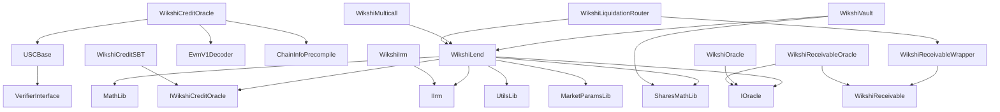

# Contracts

Wikshi Protocol smart contracts — Solidity 0.8.26, optimized with viaIR (200 runs, Cancun EVM).

## Structure

```
contracts/
├── core/           # Protocol core (5 contracts, ~2,350 LoC)
├── interfaces/     # Protocol interfaces (6 files, ~515 LoC)
├── libraries/      # Math and utility libraries (4 files, ~150 LoC)
├── periphery/      # Non-core contracts (7 files, ~800 LoC)
├── vendor/         # USC precompile wrappers (4 files, ~850 LoC)
└── mocks/          # Test-only contracts (3 files, ~165 LoC)
```

## Dependency Graph



## Compilation

```bash
npx hardhat compile
```

All contracts compile with zero errors and zero warnings.
